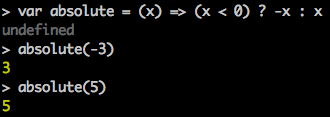
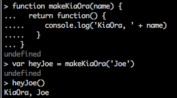
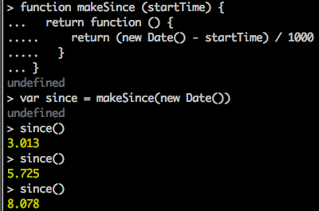

# Review

Nice work on the product objectives and user needs! I'm seething with jealousy (envy?) already! Can't wait to see how you develop this idea over the next few weeks.

HTML is great! A couple of minor niggles (try to stay under 80 characters per line, watch the indentation), but very minor. Overall, better than 90% of the handmade HTML pages out there.

Regarding accessibility, good insights. I think that the key is to recognize that we are the people with disabilities. Everyone has them&mdash;it's only a matter of degree. And as we get older, the disabilities will only worsen. So it's not like we're making "special" allowances for a few unfortunate people. Rather, we are embracing the diversity of ourselves and making the Web work for everyone&mdash;including our future selves.

Re responsive design, a big selling point is that you only have one source of truth, and you only have one codebase. That saves time and money. The only real advantage to a separate native app is if the native app needs access to some OS widget or service that the web page cannot access, but this gap is narrowing quickly. There may also be offline advantages.

On the JS:

Your `cube` function is perfect! First one I've seen this week that follows the standard.js style guide. Great work.

The `absolute` function is also perfect (excpet no spaces inside the parentheses). The only thing to consider is that you can make it a bit more readable by reversing the conditional:

```js
function absolute (x) {
  if (x < 0) {
    return x * -1
  } else {
    return x
  }
}
```

And since you put in the effort, here's a little trick just for you. Since `return` immediately ends the function call, we don't actually need that `else` block. Also, the `-` operator is a "prefix" negation operator, so we can prefix it to `x` and negate x that way. Check this out and you'll find that it works as well:

```js
function absolute (x) {
  if (x < 0) return -x

  return x
}
```

Top secret for your eyes only, there is also a little trick called the "ternary operator". It works like this: `condition ? returnIfTrue : returnIfFalse`. Take a look at this baby:

```js
function absolute (x) {
  return (x < 0) ? -x : x
}
```

Some people don't like the ternary operator because they say it's confusing and not as obvious as if/else, but I think it depends on how complicated the terms are. For something like this with such simple terms, the ternary is fine. Not all languages offer it.

With the new ECMAScript 6 (JavaScript 2015) "fat arrow" functions, we can streamline this to one line!

```js
var absolute = (x) => (x < 0) ? -x : x
```



Sweet! But keep it a secret between us!

(Just kidding! Feel free to share with your classmates when they're ready for it. We'll be covering it soon anyway. You just got a sneak preview.)

With syntax highlighting, it's still pretty easy to read, I think. (Without syntax highlighting, not so much.)

Your add-y function is close:

```js
function add(x) {
  return x + 'y'
    }
```

But really, the name should reflect what it does (and watch that indentation):

```js
function addY (x) {
  return x + 'y'
}
```

Otherwise, perfect.

The `makeKiaOra` function looks just right. Did you test it? Works perfectly for me.



OK, to the extra credit. You're on the right track. You have this:

```js
function makeSince (d) {
  var now = new Date()
  return function() {
    var since = makeSince(new Date())
  }
 }
```

OK, so we have a function `makeSince` that takes a date `d` (let's call it `startTime` to make it more clear). And it returns a function that takes nothing. That function should return the number of seconds between the datetime we passed in and the datetime when then returned function is called. Whew. Hard to wrap one's head around that, eh?

So let's work from the inside out. We know that we want to return a *difference* between two dates. The later date is the bigger number, so that goes first. That would be the time we *call* the returned function, so we'll want to create that Date object inside that function. Then we'll need to return the difference between that and the `startTime` datetime we passed in:

```js
return new Date() - startTime
```

That's not too difficult. You're making the `now` date in the outer function, which means that it will be set once when we create the inner function and return it. But then you're not using it anyway. So we can drop it. Here's what we have so far. We also don't need to set a variable inside the inner function, we just need to return something. So here is the function we want to *return*:

```js
function () {
  return new Date() - startTime
}
```

And we need to get that `startTime` from the outer function. So let's set the outer function up to take a `startTime` and return the inner fuction:

```js
function makeSince (startTime) {
  return function () {
    return new Date() - startTime
  }
}
```

There's only one problem remaining to fix. The date difference returns the number of *milliseconds* difference, and we want it as seconds, so we'll need to divide by 1000 to get seconds:
```js
function makeSince (startTime) {
  return function () {
    return (new Date() - startTime) / 1000
  }
}
```

(We need the parentheses to make sure we do the subtraction *first*.)

That seems to work:



Slack me if that doesn't make sense! And do play with it in the node REPL.

Nice work. I hope you're enjoying this. It will get more interesting very quickly now.
